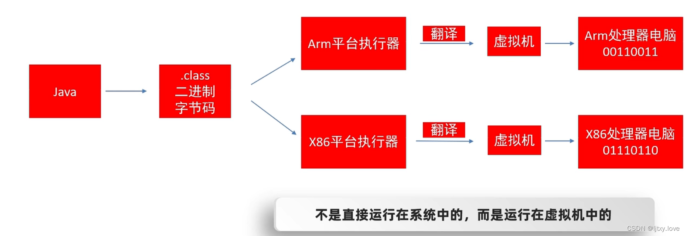
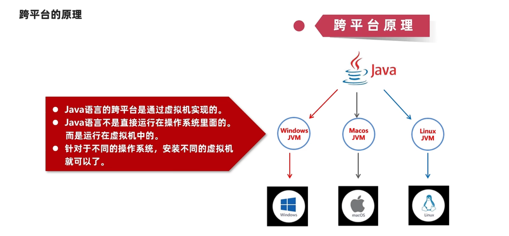

# Java

## Java简介
Java是一种广泛使用的计算机编程语言，由Sun Microsystems（后来被Oracle收购）在1995年推出。它被设计为一种通用的、面向对象的编程语言，具有跨平台性和可移植性。
### 特点
* 简单易学：Java采用类似于C++的语法，但它去除了一些容易导致错误的复杂特性，使得它更加简单易学。
* 面向对象编程：Java是一种完全面向对象编程语言，这意味着所有的程序元素都是对象，通过对象之间的交互实现程序的逻辑。
* 跨平台性：Java程序在不同平台上可以运行，这是因为Java程序通过JVM（Java虚拟机）来运行，JVM能够在不同平台上执行相同的Java代码。
* 安全性：Java是一种安全性较高的编程语言，因为它具有内置的安全机制，如内存管理、异常处理和访问控制。
* 高性能：尽管Java是一种解释型语言，但它可以通过JIT（即时编译）技术提高性能。
* 多线程支持：Java提供了内置的多线程支持，使得程序员可以很方便地编写多线程程序。
* 开源免费：Java是一种开源免费的编程语言，可以通过许多渠道获得它的开发工具和运行环境。
### Java语言跨平台的原理
* 操作系统本身其实是不认识Java语言的。
* 但是针对于不同的操作系统，Java提供了不同的虚拟机。

### Java能做什么
* Web 应用开发：
Java 提供了丰富的 Web 开发框架，如 Spring、SpringMVC 和 Mybatis，使得开发高性能和可扩展的 Web 应用变得更加容易。
* 移动应用开发：
Java 是 Android 应用开发的主要语言。开发者使用 Java 及其相关工具开发各种类型的 Android 应用。
* 桌面应用开发：
使用 Java 的 Swing、JavaFX 等库，可以开发跨平台的桌面应用程序。
* 大数据处理：
Java 在大数据领域也有重要地位。Hadoop 等大数据处理框架就是用 Java 编写的。
* 嵌入式系统开发：
Java 在嵌入式系统中的应用也很广泛，比如智能卡、嵌入式设备等。
* 分布式系统：
Java 提供了强大的网络编程能力和分布式计算支持，可以用来开发分布式系统和微服务架构。
* 游戏开发：
尽管 Java 不是最流行的游戏开发语言，但一些 2D 和 3D 游戏也用 Java 开发，尤其是使用 libGDX 等游戏开发框架。
* 科学计算：
Java 也用于科学计算和研究领域，利用其强大的性能和稳定性。
* 云计算：
Java 是许多云计算平台的基础，提供了开发云端应用和服务的支持。
Java 的跨平台特性（"一次编写，到处运行"）和强大的标准库使其成为一个非常灵活和强大的编程语言。
## Java环境搭建

变量名：JAVA_HOME

变量值：C:\Program Files (x86)\Java\jdk1.8.0_91        // 要根据自己的实际路径配置

变量名：CLASSPATH

变量值：.;%JAVA_HOME%\lib\dt.jar;%JAVA_HOME%\lib\tools.jar;         //记得前面有个"."

变量名：Path

变量值：%JAVA_HOME%\bin;%JAVA_HOME%\jre\bin;

**测试JDK是否安装成功**
1. "开始"->"运行"，键入"cmd"；
2. 键入命令: java -version、java、javac 几个命令，出现以下信息，说明环境变量配置成功；
## 基础语法
### 数据类型

### 流程控制

### 数组

## 常用类
### String

### 日期时间

## 集合类

## 泛型

## 注解

## 异常处理

## IO流

## 反射
